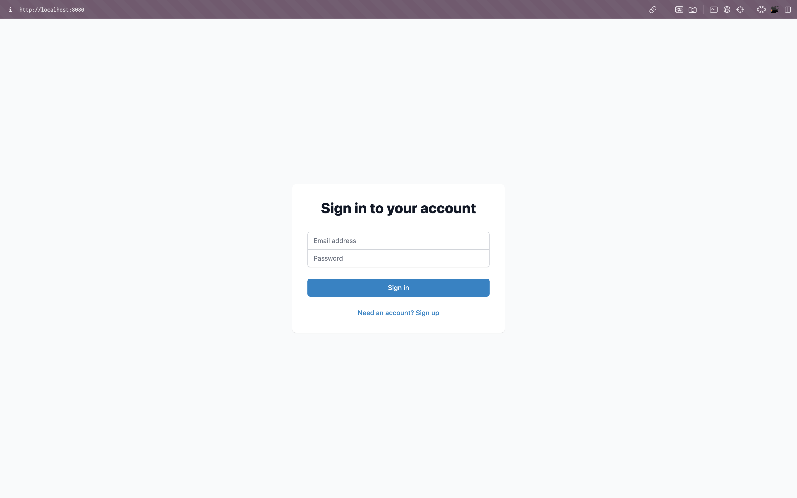
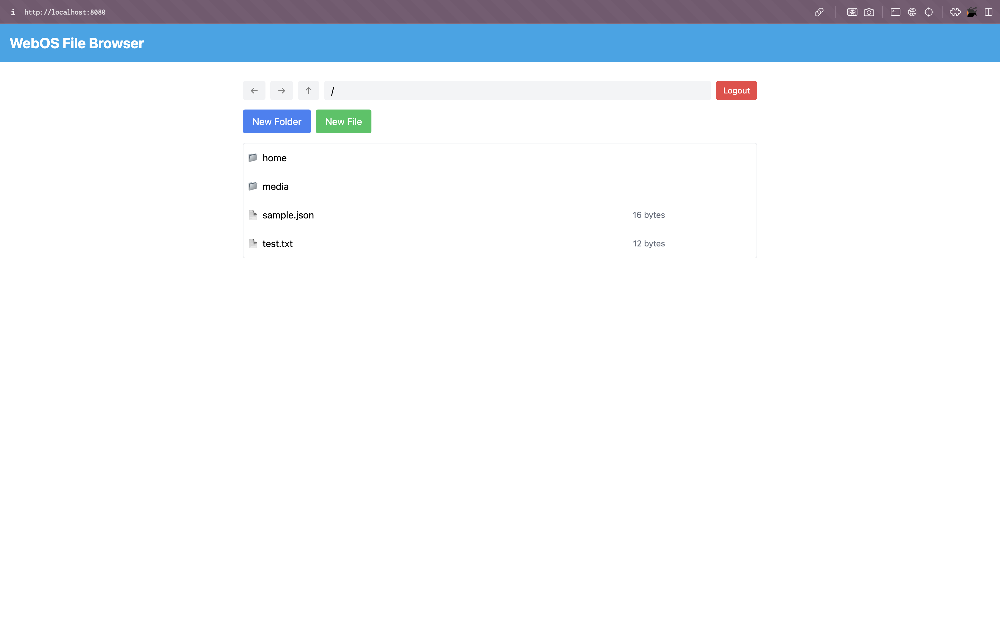

# WebOS File Browser

A file browser app for webOS, built with Enact, that provides a user-friendly interface for file management and enhances accessibility on webOS devices.

---

## Table of Contents
1. [Description](#description) - Overview of the project and its purpose
2. [Getting Started](#getting-started) - Steps to set up and run the project
   - [Prerequisites](#prerequisites) - Required software and system dependencies
   - [Installing](#installing) – Instructions for downloading, installing, and setting up the project
3. [Usage](#usage) – How to use the application and its key feature
   - [Features](#features) – List of functionalities provided by the application
   - [Example Screenshots](#example-screenshots) – Visual examples of the UI and functionality
4. [Documentation](#documentation) – Additional resources and references for development
   - [Frontend Documentation](#frontend-documentation) – Details on frontend development and structure
   - [Backend Documentation](#backend-documentation) – Information about backend architecture and APIs
   - [Additional Resources](#additional-resources) – Links to coding style, testing guides, and changelogs
5. [Demo](#demo) – A preview of the app’s functionality in action
6. [Built With](#built-with) – Technologies and frameworks used in the project
7. [Contributing](#contributing) – Guidelines for contributing to the project
   - [Code of Conduct](#code-of-conduct) – Rules and expectations for contributors
   - [How to Contribute](#how-to-contribute) – Steps for submitting contributions
8. [Versioning](#versioning) – Information about version control and releases
9. [Contributors](#contributors) – List of project contributors and their roles
10. [License](#license) – Licensing details for the project
11. [Acknowledgments](#acknowledgments) – Special mentions and credits
12. [Issue Reporting and Feature Requests](#issue-reporting-and-feature-requests) – How to report bugs and request new features

---

## Description

webOS is a Linux-based operating system developed by LG Electronics, primarily used as an embedded system in devices such as smart TVs and Internet of Things (IoT) devices. Despite its widespread use, the webOS app development market remains relatively inactive due to a lack of development resources. As a result, basic applications like file explorers are often not well-implemented.

This project addresses these challenges by creating a GUI-based file explorer application to enhance accessibility for users. The app aims to provide essential tools for file management, improving the overall software environment on webOS devices.

---

## Getting Started

Follow these instructions to set up and run the project on your local machine for development and testing.

### Prerequisites

Ensure you have the following tools installed:

- **Node.js** and **npm** for building and running the frontend.
- **webOS SDK tools** (e.g., `ares-install`, `ares-package`) for deploying the app.
- A **webOS device** for testing.

Example installation:

```bash
# Install Node.js and npm
sudo apt update
sudo apt install nodejs npm

# Install webOS SDK tools
sudo apt install webos-dev-tools
```

### Installing

1. Clone the repository and navigate to the project directory:
   ```bash
   git clone https://github.com/snucse-cts/webosFileBrowser.git
   cd webosFileBrowser
   ```

2. Install dependencies:
   ```bash
   npm install
   ```

3. Build the application:
   ```bash
   npm run pack
   ```

4. Deploy the app to a webOS device:
   ```bash
   ares-package dist
   ares-install --device <device_name> ./io.webosfilebrowser_1.0.0_all.ipk
   ```

---

## Usage

### Features

- **Browse Files**: Navigate directories by clicking on folders.
- **Create a New Directory**: Use the "Create" button, name the folder, and confirm.
- **Rename or Delete Files**: Select a file or folder, then choose "Rename" or "Delete."

### Example Screenshots


#### Login Page
The login screen allows users to authenticate with their credentials before accessing the file browser.



#### Main Interface
After logging in, users are greeted with a clean, intuitive file browser interface. Key features include:
- Navigation through directories.
- Buttons to create new files or folders.
- Display of file size and type.



---

## Documentation

### Frontend Documentation
For details on coding style, testing, and setup for the frontend, refer to the [Frontend README](frontend/README.md).

### Backend Documentation
For API specifications, coding standards, and backend details, refer to:
- [Backend README](backend/README.md)
- [API Specification](docs/SPEC.md)

### Additional Resources
- **Coding Style**: See [Frontend Coding Style](frontend/README.md#coding-style) and [Backend Coding Style](backend/README.md#coding-style).
- **Testing Guide**: Refer to [Frontend Testing](frontend/README.md#testing) and [Backend Testing](backend/README.md#testing).
- **Changelog**: Updates are documented in the [Frontend Changelog](frontend/README.md#changelog) and [Backend Changelog](backend/README.md#changelog).

---

## Demo

The application provides a seamless user experience for managing files on webOS devices, enhancing accessibility and ease of use.

---

## Built With

- [Enact](https://enactjs.com/) - UI Framework for the frontend
- [Node.js](https://nodejs.org/) - Runtime for development
- **Luna Bus** - Backend communication system for webOS devices

---

## Contributing

We welcome contributions from the community! Please check the [Contributing Guidelines](CONTRIBUTING.md) for details on how to get started.

Before creating an issue or submitting a pull request, please use our templates:
- [Bug Report Template](.github/ISSUE_TEMPLATE/bug_report.md)
- [Feature Request Template](.github/ISSUE_TEMPLATE/feature_request.md)
- [Pull Request Template](.github/PULL_REQUEST_TEMPLATE.md)

### Code of Conduct

Please read our [Code of Conduct](CODE_OF_CONDUCT.md) to understand the expectations for behavior within the community.

### How to Contribute

1. Fork the repository and clone it to your local machine.
2. Create a new branch for your feature or bug fix:
   ```bash
   git checkout -b feature/your-feature-name
   ```
3. Make your changes and commit them with clear messages:
   ```bash
   git commit -m "Add detailed description of your changes"
   ```
4. Push your changes to your fork and submit a pull request.

For detailed contribution guidelines, see [CONTRIBUTING.md](CONTRIBUTING.md).

---

## Versioning

This project uses [Semantic Versioning](https://semver.org/). For available versions, see the [tags on this repository](https://github.com/snucse-cts/webosFileBrowser/tags).

---

## Contributors

- **Kim Dohyun** - Frontend Development
- **Sim Yugeun** - Backend Development
- **Seoha Park** - Contributor

---

## License

This project is licensed under the MIT License. See the [LICENSE](LICENSE) file for details.

---

## Acknowledgments

- LG Electronics for developing webOS and supporting open-source contributions.
- Inspiration from file browser apps on other platforms.
- Thanks to the team for their hard work and dedication.

---

## Issue Reporting and Feature Requests

We welcome contributions from the community! Before creating an issue or submitting a feature request, please review our templates:
- [Bug Report Template](.github/ISSUE_TEMPLATE/bug_report.md)
- [Feature Request Template](.github/ISSUE_TEMPLATE/feature_request.md)

For pull requests, please use the [Pull Request Template](.github/PULL_REQUEST_TEMPLATE.md).
